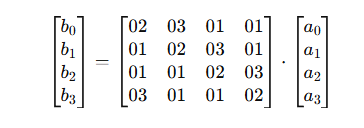

# AES(Advanced Encryption System)_Team Project
*A simple model of AES containing only the main models and it's leaf cells*
<h1 align="center">AES Encryption Project</h1>

Implementation of the Advanced Encryption Standard (AES) algorithm with core encryption and decryption modules.

<h2> Project Overview</h2>

This project demonstrates the implementation of the 
<b>Advanced Encryption Standard (AES)</b>, a symmetric-key encryption algorithm 
used worldwide for secure data communication.
The project focuses on the major AES transformation modules and their inverse operations.

<h2> Core Modules</h2>

<h3>1️ State Matrix</h3>

The plaintext is converted into a <b>4×4 byte matrix</b> called the 
<code>State Matrix</code>. All AES operations are performed on this matrix. For each value within the matrix is a 8-bit value and each coloumn/row is 32 bits. 4x4 Matrix gives you 128-bits(16Bytes)

<h3>2️ SubBytes</h3>

The <code>SubBytes</code> transformation replaces each byte in the state matrix 
using the AES S-Box to provide non-linearity and improve security.
  The S-box is a fixed LUT which has 256 different possible values through Finite Field of 256 elements(Galois Field GF(2^8))
  <h3>How the S-Box is generated:</h3>
  The polynomial ( m(x) = x^8 + x^4 + x^3 + x + 1 ) (hex: `0x11B`) is used to define the finite field **GF(2⁸)** in which all AES byte operations take place. In the context of the S-Box, it is specifically used when computing the **multiplicative inverse of each byte**. Since AES treats each byte as a polynomial over GF(2⁸), any multiplication that results in a degree higher than 7 is reduced using this irreducible polynomial. This ensures that all results stay within 8 bits (0x00–0xFF) and remain valid elements of the field.

Once the multiplicative inverse of a byte is computed using this field (defined by ( m(x) )), the result is then passed through an **affine transformation** (bitwise matrix operation with XOR constant `0x63`) to produce the final S-Box value. So, the polynomial is not directly applied during S-Box lookup, but it is essential because it defines the arithmetic rules used to generate the inverses that form the S-Box table.

<h3>3️ ShiftRows</h3>

In the <code>ShiftRows</code> step, rows of the state matrix are cyclically shifted 
to enhance diffusion across the data.
  In AES ShiftRows, all rows of the state matrix are involved, but they are shifted by different fixed offsets. The state is a 4×4 byte matrix, and the shifting is done row-wise from left to right (circular shift).

The rule is:

Row 0: no shift (stays the same)
Row 1: shift left by 1 byte
Row 2: shift left by 2 bytes
Row 3: shift left by 3 bytes

<h3>4️ MixColumns</h3>

The <code>MixColumns</code> operation performs matrix multiplication in 
Galois Field arithmetic to mix the bytes within each column.
  
  For a single coloumn, the equations are as follows:
  b0 = (02 · a0) ⊕ (03 · a1) ⊕ a2 ⊕ a3
b1 = a0 ⊕ (02 · a1) ⊕ (03 · a2) ⊕ a3
b2 = a0 ⊕ a1 ⊕ (02 · a2) ⊕ (03 · a3)
b3 = (03 · a0) ⊕ a1 ⊕ a2 ⊕ (02 · a3)
  For it to affect the entire Matrix values, we do it to all four coloumns.

  <h3>GF multiplier</h3>
  

<h3>5️ Key Expansion</h3>

The <code>Key Expansion</code> module generates multiple round keys from the original cipher key.
These keys are used in different AES rounds during encryption and decryption.

<h2> Inverse Operations</h2>

<h3>1️ InvSubBytes</h3>

Reverses the <code>SubBytes</code> transformation using the inverse S-Box.

<h3>2️ InvShiftRows</h3>

Reverses the cyclic row shifts performed during the <code>ShiftRows</code> step.

<h3>3️ InvMixColumns</h3>

Reverses the <code>MixColumns</code> transformation using inverse matrix multiplication.

<h2> Conclusion</h2>

This project provides a practical understanding of AES encryption and decryption
by implementing the core transformation modules and their inverse operations.

